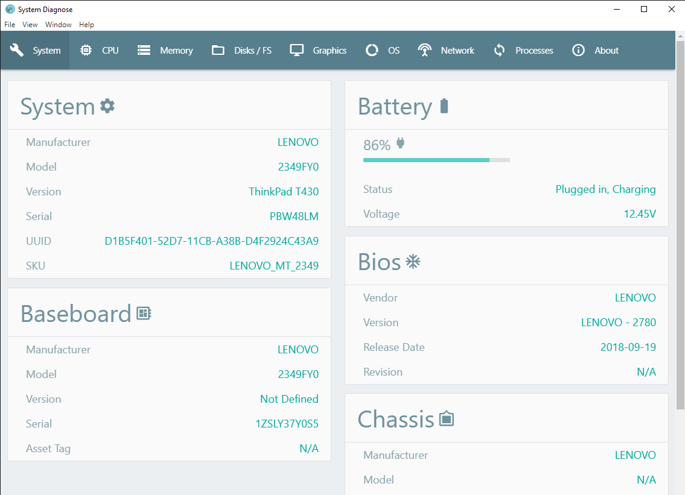
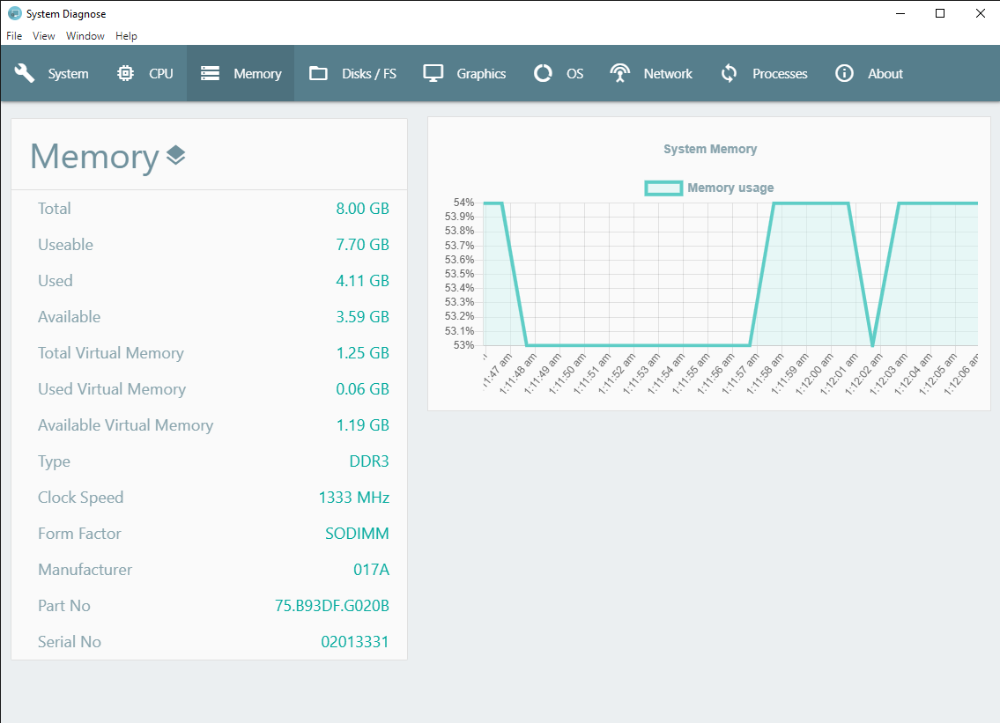
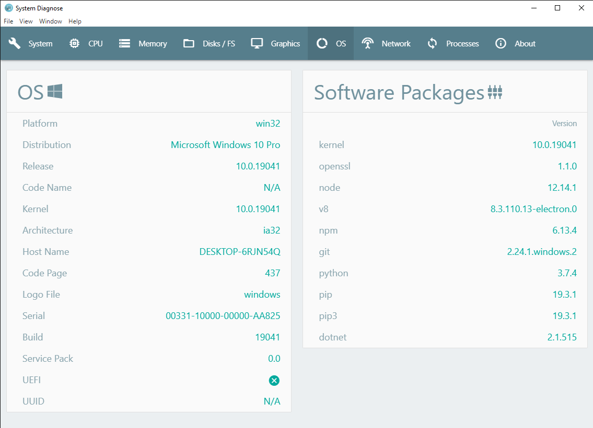
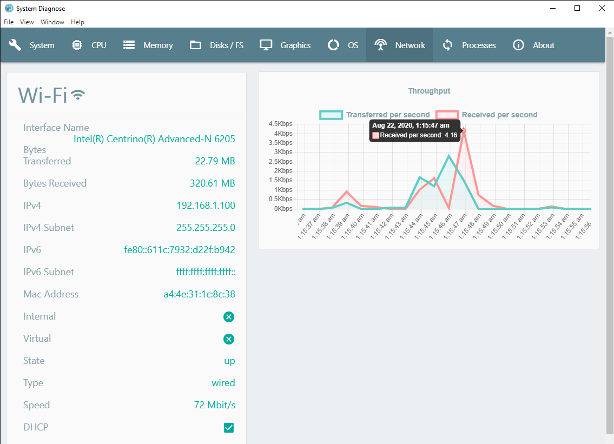
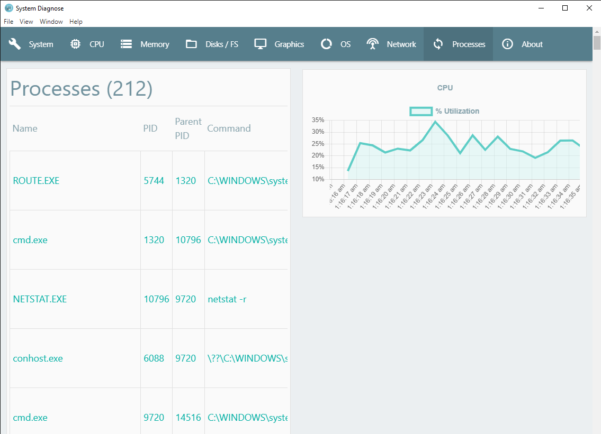
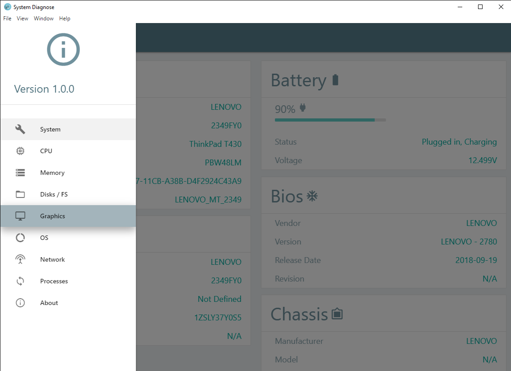

# Electron System Diagnose Desktop App

This is a cross platform System Diagnose desktop application built on electron.

> [Download the app for windows](https://github.com/AbdulMoizAli/System-Diagnose/releases/download/v1.0.0/win32-release-builds.zip)

### Version
1.0.0

## Usage

### Installation

Install the dependencies

```sh
$ npm install
```

### Serve
To run electron

```sh
$ npm start
```

### To Package & Build

For Windows

```sh
$ npm run package-win
```

For Mac

```sh
$ npm run package-mac
```

For Linux

```sh
$ npm run package-linux
```

## Mockups













